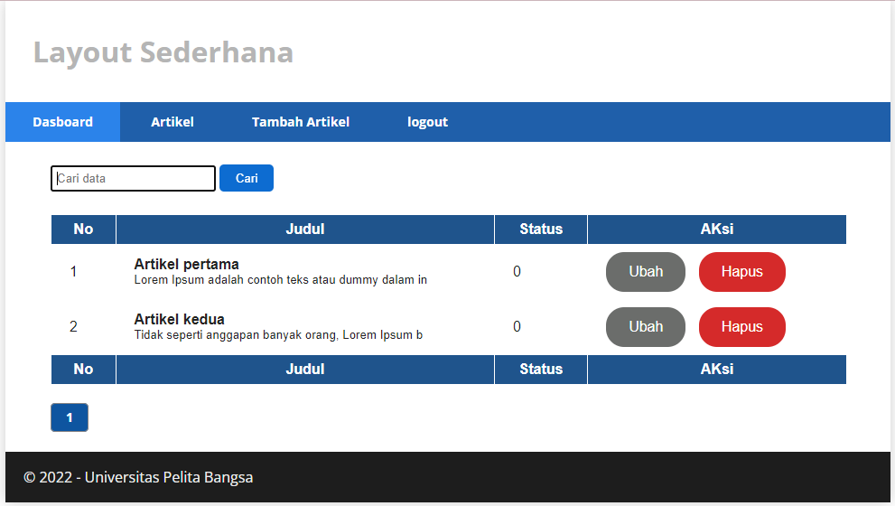
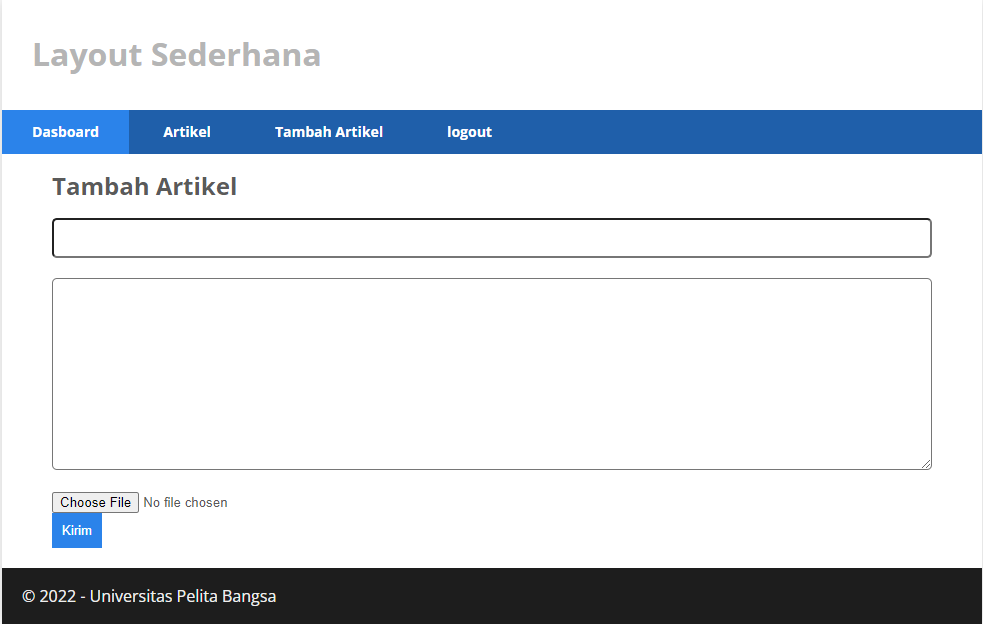

|   DEVI SILMA YUNIAR   | 312010458 |
|-----------------------|-----------|
|       PERTEMUAN 13    |PRAKTIMUM12|

### Langkah-langkah Praktikum

Membuat Pagination
Pagination merupakan proses yang digunakan untuk membatasi tampilan yang panjang
dari data yang banyak pada sebuah website. Fungsi pagination adalah memecah
tampilan menjadi beberapa halaman tergantung banyaknya data yang akan ditampilkan
pada setiap halaman.

Pada Codeigniter 4, fungsi pagination sudah tersedia pada Library sehingga cukup
mudah menggunakannya.
Untuk membuat pagination, buka Kembali Controller Artikel, kemudian modifikasi
kode pada method admin_index seperti berikut.

        public function admin_index()
        {
            $title = 'Daftar Artikel';
            $model = new ArtikelModel();
            $data = [
                'title' => $title,
                'artikel' => $model->paginate(10), #data dibatasi 10 record per halaman
                'pager' => $model->pager,
            ];
            return view('artikel/admin_index', $data);
        }

        <?= $pager->links(); ?>

Selanjutnya buka kembali menu daftar artikel, tambahkan data lagi untuk melihat
hasilnya.

### Membuat Pencarian
Pencarian data digunakan untuk memfilter data.
Untuk membuat pencarian data, buka kembali Controller Artikel, pada method
admin_index ubah kodenya seperti berikut

        public function admin_index()
        {
            $title = 'Daftar Artikel';
            $q = $this->request->getVar('q') ?? '';
            $model = new ArtikelModel();
            $data = [
                'title' => $title,
                'q' => $q,
                'artikel' => $model->like('judul', $q)->paginate(10), # data dibatasi 10 record per halaman
                'pager' => $model->pager,
            ];
            return view('artikel/admin_index', $data);
        }

Kemudian buka kembali file views/artikel/admin_index.php dan tambahkan form
pencarian sebelum deklarasi tabel seperti berikut:

        <form method="get" class="form-search">
        <input type="text" name="q" value="<?= $q; ?>" placeholder="Cari data">
        <input type="submit" value="Cari" class="btn btn-primary">
        </form>

Dan pada link pager ubah seperti berikut.

        <?= $pager->only(['q'])->links(); ?>

### Upload Gambar

Menambahkan fungsi unggah gambar pada tambah artikel. Buka kembali Controller
Artikel, sesuaikan kode pada method add seperti berikut:

        public function add()
        {
        // validasi data.
        $validation = \Config\Services::validation();
        $validation->setRules(['judul' => 'required']);
        $isDataValid = $validation->withRequest($this->request)->run();
        if ($isDataValid)
        {
        $file = $this->request->getFile('gambar');
        $file->move(ROOTPATH . 'public/gambar');
        $artikel = new ArtikelModel();
        $artikel->insert([
        'judul' => $this->request->getPost('judul'),
        'isi' => $this->request->getPost('isi'),
        'slug' => url_title($this->request->getPost('judul')),
        'gambar' => $file->getName(),
        ]);
        return redirect('admin/artikel');
        }
        $title = "Tambah Artikel";
        return view('artikel/form_add', compact('title'));
        }

Kemudian pada file views/artikel/form_add.php tambahkan field input file seperti
berikut.

        

        <input type="file" name="gambar">
        

        Dan sesuaikan tag form dengan menambahkan ecrypt type seperti berikut.
        <form action="" method="post" enctype="multipart/form-data">

Ujicoba file upload dengan mengakses menu tambah artikel.

