|   DEVI SILMA YUNIAR   | 312010458 |
|-----------------------|-----------|
|       PERTEMUAN 13    |PRAKTIMUM12|

## PRAKTIKUM 12 : FRAMEWORK LANJUTAN (CRUD)

## Intruksi praktikum
- Persiapkan text editor misalnya VSCode.
- Buka kembali folder dengan nama lab11_php_ci pada docroot webserver (htdocs)
- Ikuti langkah-langkah praktikum yang akan dijelaskan berikutnya.

## LANGKAH-LANGKAH PRAKTIKUM

## 1. PERSIAPAN
 Untuk memulai membuat aplikasi CRUD sederhana, yang perlu disiapkan adalah database server menggunakan MySQL. Pastikan MySQL Server sudah dapat dijalankan melalui XAMPP. Membuat Database: Studi Kasus Data Artikel.

 ## 2. MEMBUAT DATABASE
 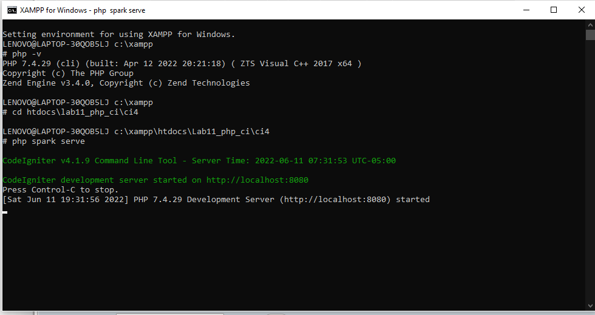

 ## 3. MEMBUAT TABLE ARTIKEL
 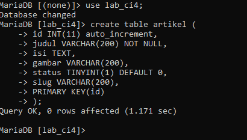

 ## 3. KONFIGURASI KONEKSI DATABASE
 Konfigurasi Koneksi Database, konfigurasi untuk menghubungkan dengan database, setver. Konfigurasi dapat dilakukan dengan dua cara yaitu :
1. App/config/database.php
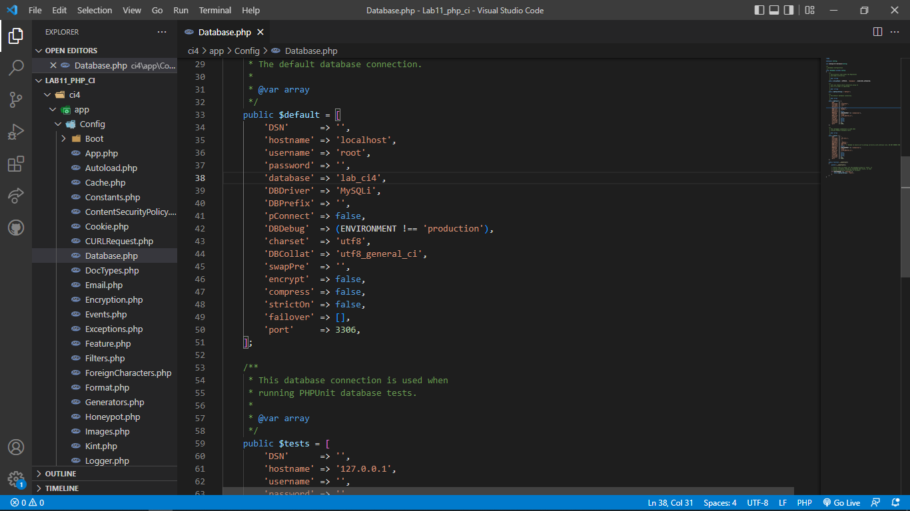

2. Pada bagian  file.env
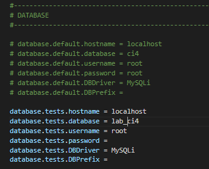

## 4.MEMBUAT MODEL

Selanjutnya adalah membuat Model untuk memproses data Artikel. Buat file baru pada direktori app/Models dengan nama ArtikelModel.php
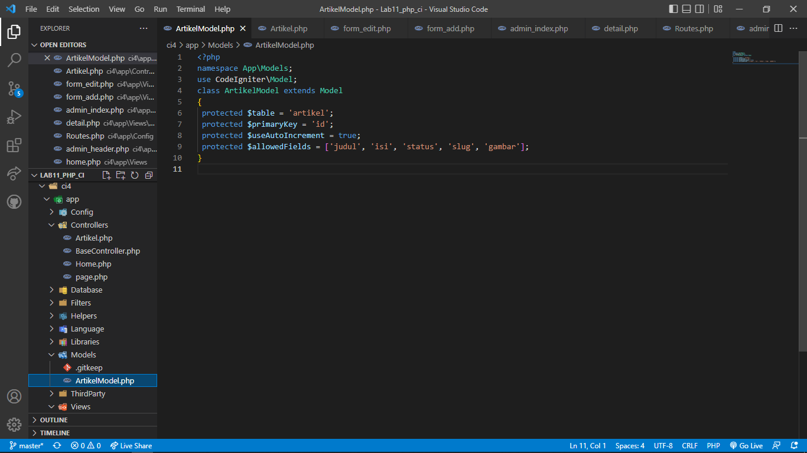

## 5. MEMBUAT CONTROLLER
Buat Controller baru dengan nama Artikel.php pada direktori app/Controllers.
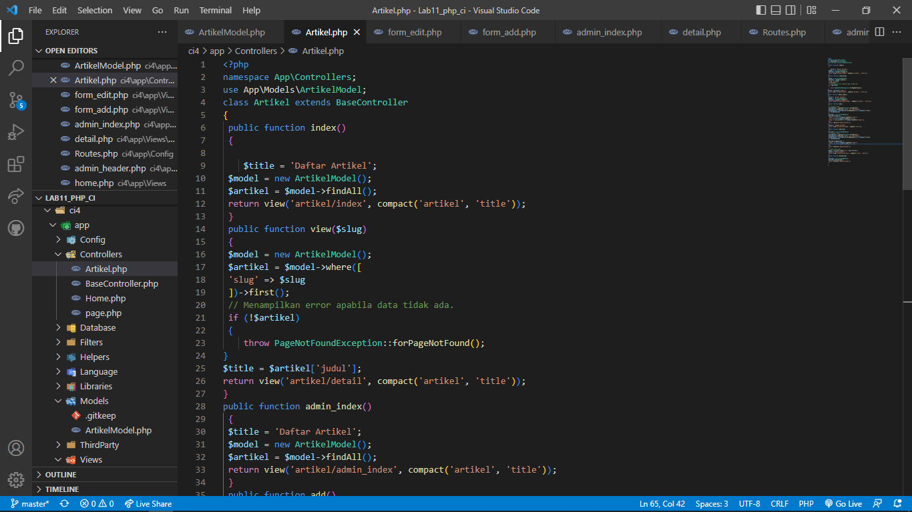

## 6. MEMBUAT VIEW
Buat direktori baru dengan nama artikel.
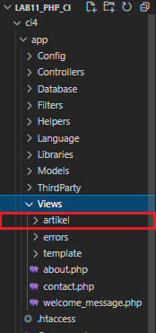

Pada direktori app/views, kemudian buat file baru dengan nama index.php
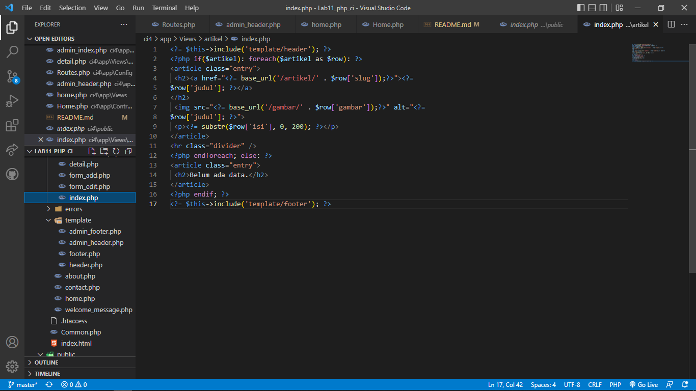

selanjutnya buka browsur, dengan mengakses URL http://localhost:8080/artikel
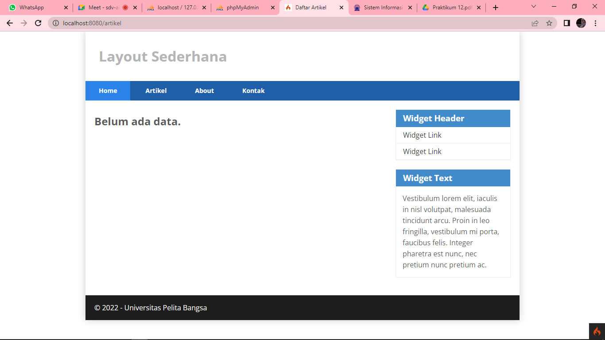

Belum ada data yang ditampilkan. maka tambahkan beberapa data beberapa data pada database agar bisa tampil.
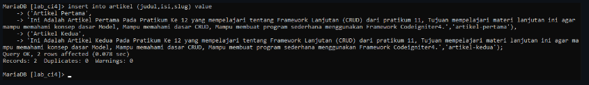

Refresh kembali browser, sehingga akan tampilkan hasilnya.

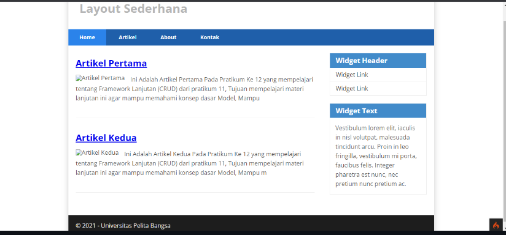

## 7.MEMBUAT TAMPILAN DETAIL ARTIKEL
Tampilan pada saat judul berita di klik maka akan diarahkan ke halaman yang berbeda. Tambahkan fungsi baru pada Controller Artikel dengan nama view().

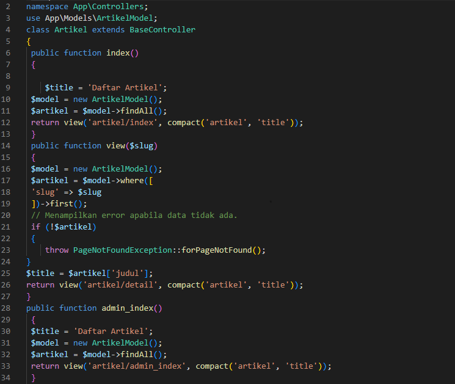

## 8.MEMBUAT ROUTING UNTUK ARTIKEL DETAIL
Buka kembali file app/config/routtes.php, kemudian tambahkan routing untuk artikel detail.
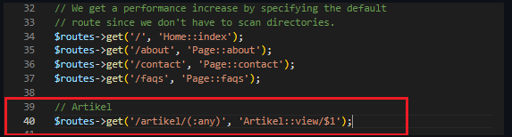

Refresh kembali browsser, lalu pilih satu artikel sehingga akan ditampilkan hasilnya.
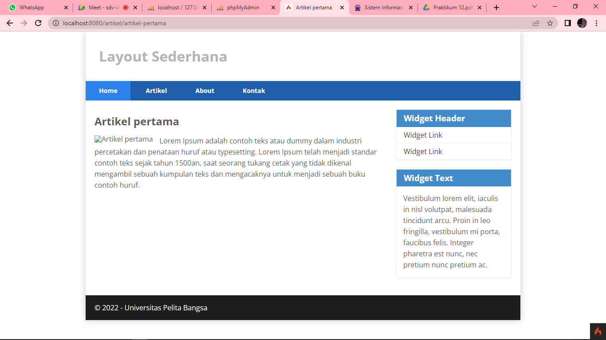

## 9.MEMBUAT MENU ADMIN
Menu admin adalah untuk proses CRUD data artikel. Buat method baru pada Controller Artikel dengan nama admin_index().
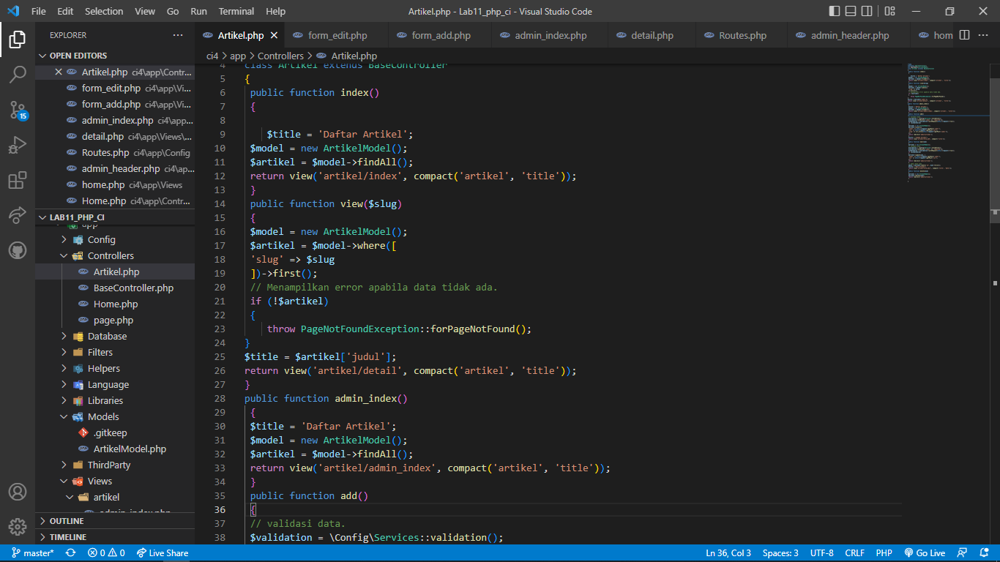

Selanjunya pada bagian views artikel buat file dengan nama admin_index.php
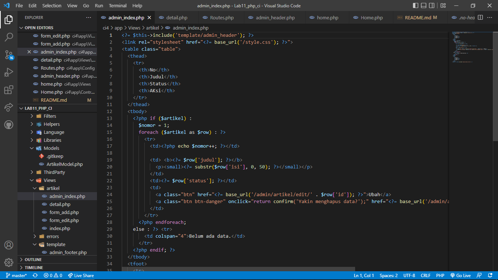

Tambahkan routing untuk menu admin seperti berikut :
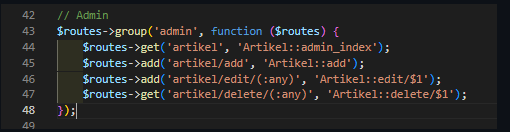

Akses menu admin dengan url http://localhost:8080/admin/artikel

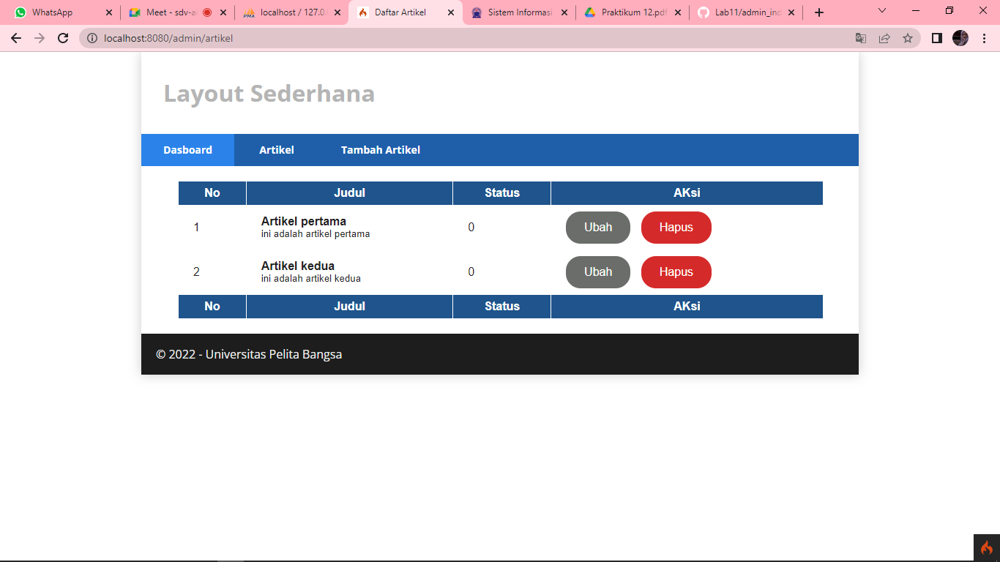

## 10.MEMBUAT DATA ARTIKEL

Tambahkan fungsi/method baru pada controller artikel dengan nama add().

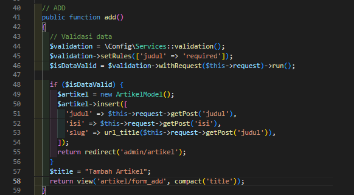

Kemudian buat view untuk form tambah dengan nama form_add.php
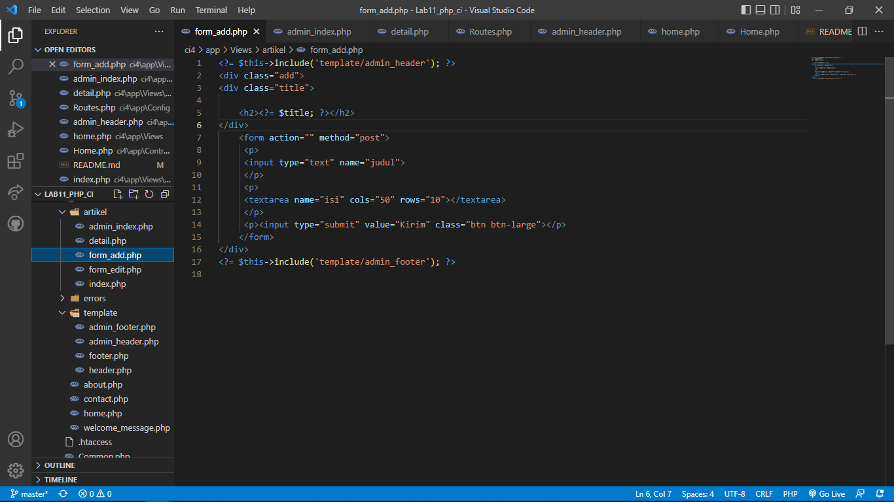

Refresh browser lalu klik tombol ubah
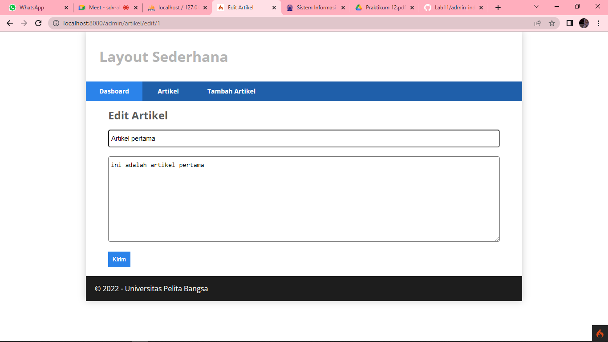

## 11.MENGHAPUS DATA

Tambahkan fungsi/method baru pada controller artikel dengan nama delete().

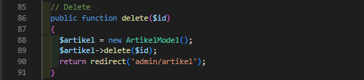

Maka bila dijalankan dibrowsur akan muncul seperti :

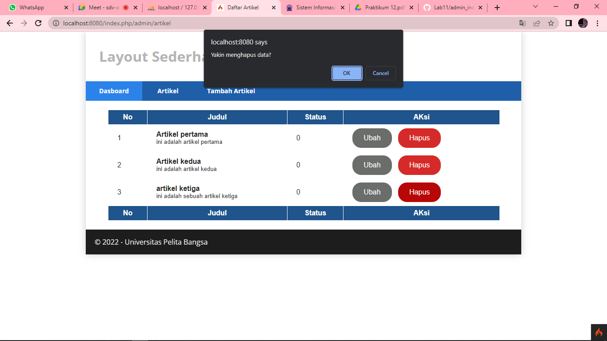

## PERTANYAAN DAN TUGAS

Selesaikan programnya sesuai Langkah-langkah yang ada. Anda boleh melakukan improvisasi.

- Bagian Dirubah
Merubah tampilan Dashbord yang sebelumnya menampilkan id dirubah dengan menampilkan nomor urut dengan looping.

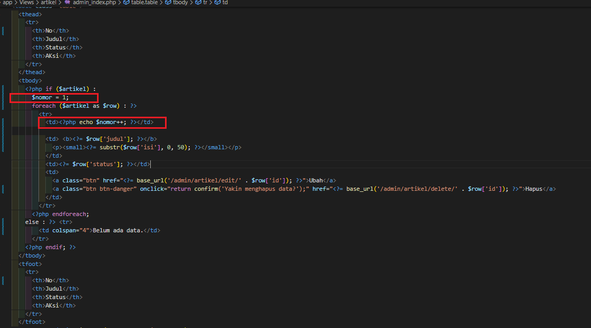

Maka hasilnya sebagai berikut :

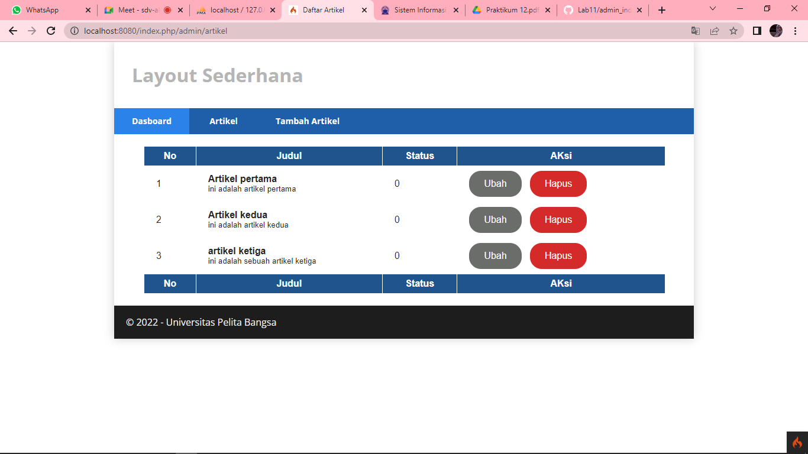

- Merubah Tampilan Artikel Yang sebelumnya Bagian judul berwarna biru di rubah dengan warna hitam dan menghilangkan garis bawah, dan ketika curous didekatkan ke dalam judul maka akan berubah warna menjadi biru.
Pada bagian inde.php deberikan nama class baru dengan nama class="artikel_index"

Selanjutnya menambahkan css untuk index.php
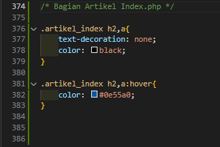

text-decoration: none; untuk menghilangkan garis bawah pada link judul. color: black; Untuk memberikan warna pada text menjadi hitam

a:hover dan color: #0e55a0; ketika cursor mendekat ke bagian judul makan judul akan berubah menjadi biru.

--------------------------------------------------------------------------------------------------------------------
                                                    SELESAI
                                            SEKIAN DAN TERIMAKASIH
--------------------------------------------------------------------------------------------------------------------
                                                @devisilma26