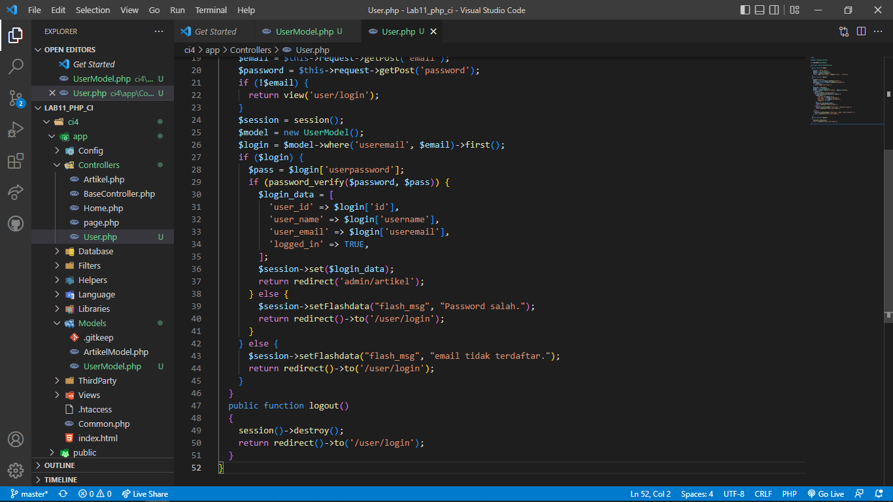

# PRAKTIKUM 13 Framework lanjutan (Modul Login)

Nama : Devi Silma Yuniar
NIM  : 312010458
Kelas : TI.20.A2

## langkah-langkah praktikum

## persiapan
Untuk memulai membuat modul Login, yang perlu disiapkan adalah database server menggunakan MySQL. Pastikan MySQL Server sudah dapat dijalankan melalui XAMPP.

## 1.) MEMBUAT TABLE USER
Masuk kedalam databse lab_ci4 dan buat table baru seperti dibawah ini :

## 2.) MEMBUAT MODEL USER
Selanjutnya adalah membuat Model untuk memproses data Login. Buat file baru pada direktori app/Models dengan nama UserModel.php

## 3.) MEMBUAT CONTROLLER USER
Buat Controller baru dengan nama User.php pada direktori app/Controllers. Kemudian tambahkan method index() untuk menampilkan daftar user, dan method login() untuk proses login.

## 4.) MEMBUAT VIEW LOGIN
Buat direktori baru dengan nama user pada direktori app/views, kemudian buat file baru dengan nama login.php.

## 5.) MEMBUAT DATABASE SEEDER
Database seeder digunakan untuk membuat data dummy. Untuk keperluan ujicoba modul login, kita perlu memasukkan data user dan password kedaalam database. Untuk itu buat database seeder untuk tabel user. Buka CLI, kemudian tulis perintah berikut:

