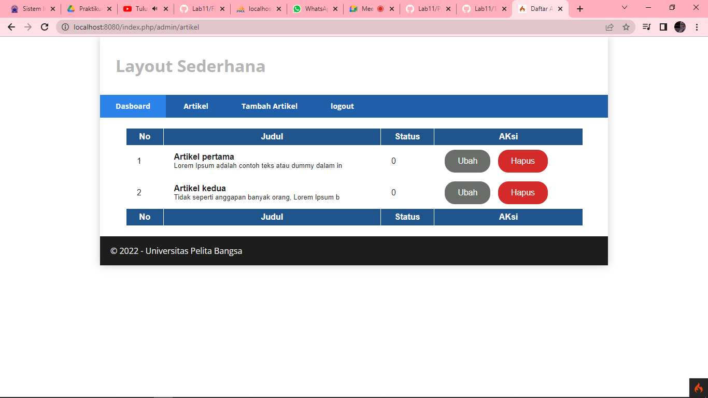

# PRAKTIKUM 13 Framework lanjutan (Modul Login)

Nama : Devi Silma Yuniar

NIM  : 312010458

Kelas : TI.20.A2

## langkah-langkah praktikum

## persiapan
Untuk memulai membuat modul Login, yang perlu disiapkan adalah database server menggunakan MySQL. Pastikan MySQL Server sudah dapat dijalankan melalui XAMPP.

## 1.) MEMBUAT TABLE USER
Masuk kedalam databse lab_ci4 dan buat table baru seperti dibawah ini :

## 2.) MEMBUAT MODEL USER
Selanjutnya adalah membuat Model untuk memproses data Login. Buat file baru pada direktori app/Models dengan nama UserModel.php

## 3.) MEMBUAT CONTROLLER USER
Buat Controller baru dengan nama User.php pada direktori app/Controllers. Kemudian tambahkan method index() untuk menampilkan daftar user, dan method login() untuk proses login.

## 4.) MEMBUAT VIEW LOGIN
Buat direktori baru dengan nama user pada direktori app/views, kemudian buat file baru dengan nama login.php.

## 5.) MEMBUAT DATABASE SEEDER
Database seeder digunakan untuk membuat data dummy. Untuk keperluan ujicoba modul login, kita perlu memasukkan data user dan password kedaalam database. Untuk itu buat database seeder untuk tabel user. Buka CLI, kemudian tulis perintah berikut:

Selanjutnya, buka file UserSeeder.php yang berada di lokasi direktori /app/Database/Seeds/UserSeeder.php kemudian isi dengan kode berikut:

Selanjutnya, buka file UserSeeder.php yang berada di lokasi direktori /app/Database/Seeds/UserSeeder.php kemudian isi dengan kode berikut:

## 6.) UJI COBA LOGIN
Selanjutnya, buka file UserSeeder.php yang berada di lokasi direktori /app/Database/Seeds/UserSeeder.php kemudian isi dengan kode berikut:

## 7.) MENAMBAHKAN AUTH FILTER
Selanjutnya membuat filer untuk halaman admin. Buat file baru dengan nama Auth.php pada direktori app/Filters.

Selanjutnya buka file app/Config/Filters.php tambahkan kode berikut:

Selanjutnya buka file app/Config/Routes.php dan sesuaikan kodenya.

## 8.) PERCOBAAN AKSES MENU ADMIN
Buka url dengan alamat http://localhost:8080/admin/artikel ketika alamat tersebut diakses maka, akan dimuculkan halaman login.

## 9.) FUNGSI LOGOUT
Tambahkan method logout pada Controller User seperti berikut:

## PERTANYAAN DAN TUGAS
Selesaikan programnya sesuai Langkah-langkah yang ada. Anda boleh melakukan improvisasi.

## Membuat tombol home pada bagian login
pada bagian views\user\login.php tembahkan tombol untuk kembali ketampilan awal.

tampilan

## Membuat tombol logout
memberikan tombol logout pada bagian admin

tampilan

--------------------------------------------------------------------------------------------------------------------
                                            SEKIAN DAN TERIMAKASIH

                                                @devisilma26                                               